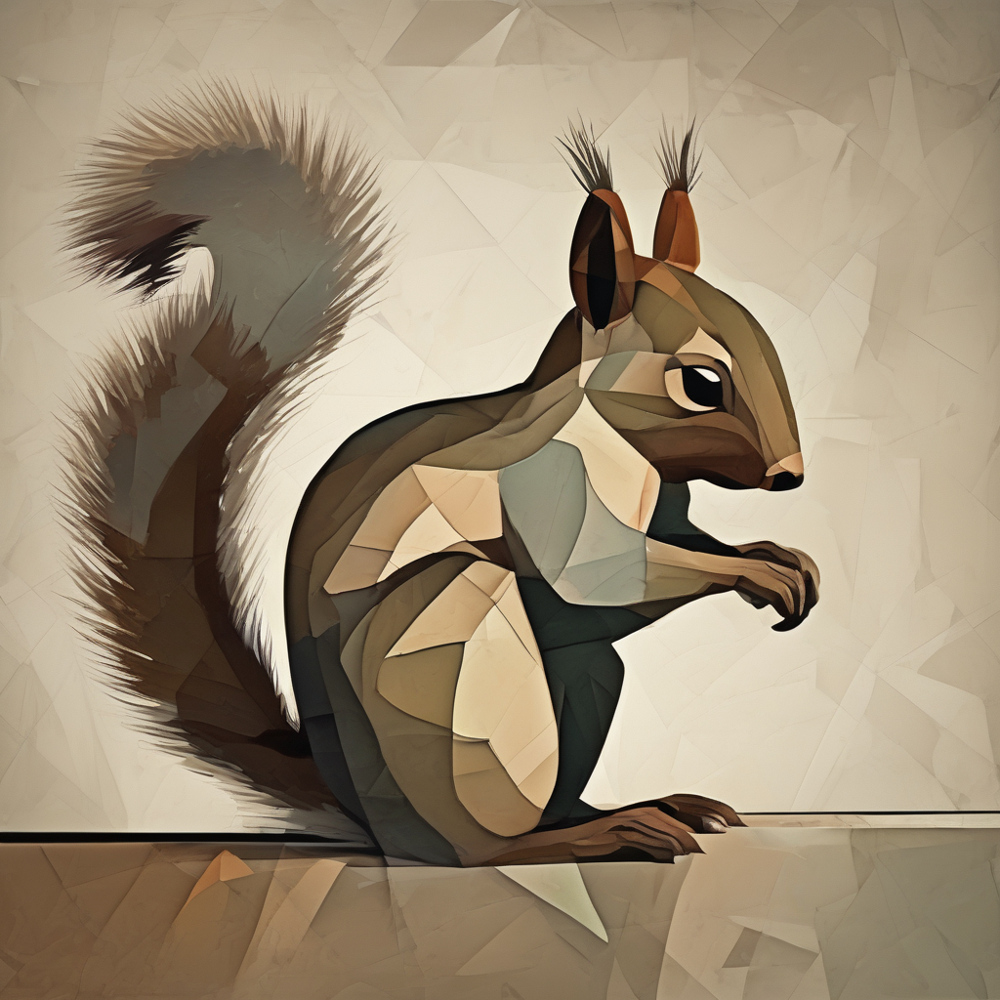

In this first article we will set-up our first text-to-image local workspace, by using the simplest model: Stable Diffusion. To do so, we will have to
- Set up a python environnement
- Download the necessary packages and write our first script
- Let the script automatically download Stable Diffusion, and do its magic.

#### 0/ Install VS Code
It will be useful to edit the scripts  
>https://code.visualstudio.com/docs/setup/mac

#### 1/ Download and install Conda
Conda will enable having local python environnements.  
For Apple M1/M2/M3/M4/M5, be sure to install the arm version  
>https://www.anaconda.com/docs/getting-started/anaconda/install/mac-cli-install

#### 2/ Create first environnement
Open a terminal and:

    mkdir lea17
    cd lea17
    conda create -n lea17
    conda activate lea17
    conda install pip

#### 3/ Directory structure
    mkdir notes
    mkdir src
    mkdir models
    mkdir output
Install necessary python libraries:

    pip install accelerate diffusers transformers torchvision

#### 4/ Launch code
We are using Stable Diffusion XL for this first test, it works well on apple silicon and is pretty fast with an M4 chip.  
>https://huggingface.co/stabilityai/stable-diffusion-xl-base-1.0

Put this script inside src/test_setup.py. Note that we can easily use float32 as a type with SDXL and 64GB of RAM.

    import torch
    from diffusers import StableDiffusionXLPipeline
    from PIL import Image

    pipe = StableDiffusionXLPipeline.from_pretrained(
        "stabilityai/stable-diffusion-xl-base-1.0",
        torch_dtype=torch.float32
    )
    # Mandatory on Apple silicon:
    pipe.to("mps")

    image = pipe("An image of a squirrel in Picasso style").images[0]

    image.save("./output/test_setup.png")

#### 5/ run the script:
    python src/test_setup.py
First run will take some time to download the model.  
Then on my M4 Max it takes less than 2s per step (for 1024px resolution), so around 1min30 for 50 steps.  
You should have an output like this:  

With a little bit more of customization:

    import torch
    from diffusers import StableDiffusionXLPipeline
    from PIL import Image
    import random
    from datetime import datetime

    pipe = StableDiffusionXLPipeline.from_pretrained(
        "stabilityai/stable-diffusion-xl-base-1.0",
        torch_dtype=torch.float32
    )
    # Mandatory on Apple silicon:
    pipe.to("mps")

    prompt = "An image of a squirrel in Picasso style"
    negative_prompt = ""
    num_inference_steps = 40
    guidance_scale = 7
    height = 1024
    width = 1024
    seed = 0

    if(0 == seed):
        seed = random.randint(0, 2**32 - 1)
    image = pipe(
        prompt = prompt,
        negative_prompt = negative_prompt,
        num_inference_steps = num_inference_steps,
        guidance_scale = guidance_scale,
        height=height, width=width,
        generator = torch.Generator(device="cpu").manual_seed(seed)
    ).images[0]
    timestamp = datetime.now().strftime("%Y-%m-%d-%H-%M-%S")
    filename = f"./output/{timestamp}-seed_{seed}.png"
    image.save(filename)

    print(f"Image saved as: {filename}")

